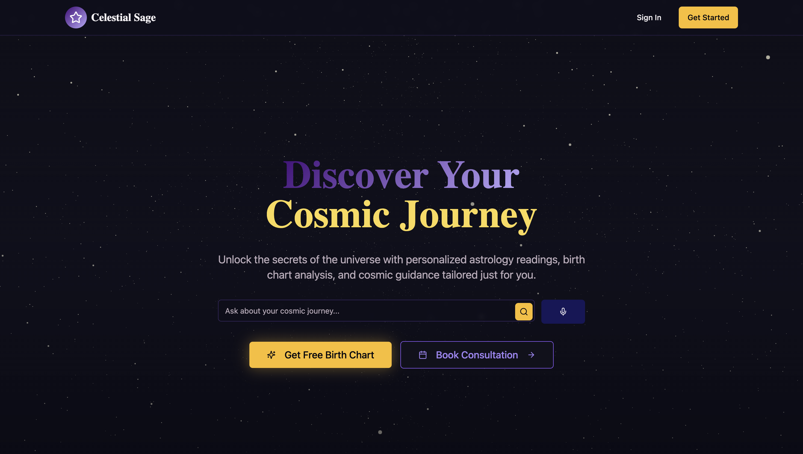
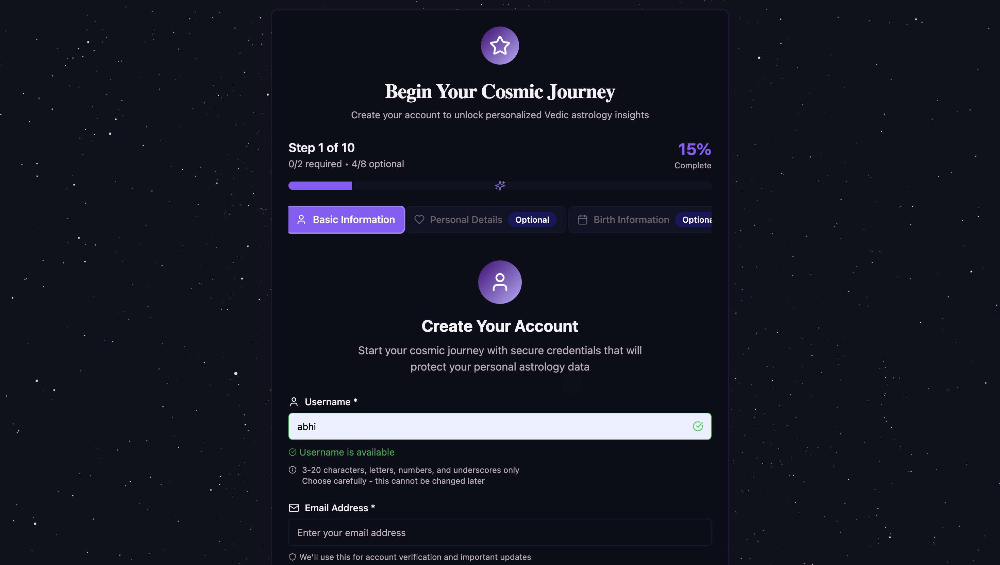
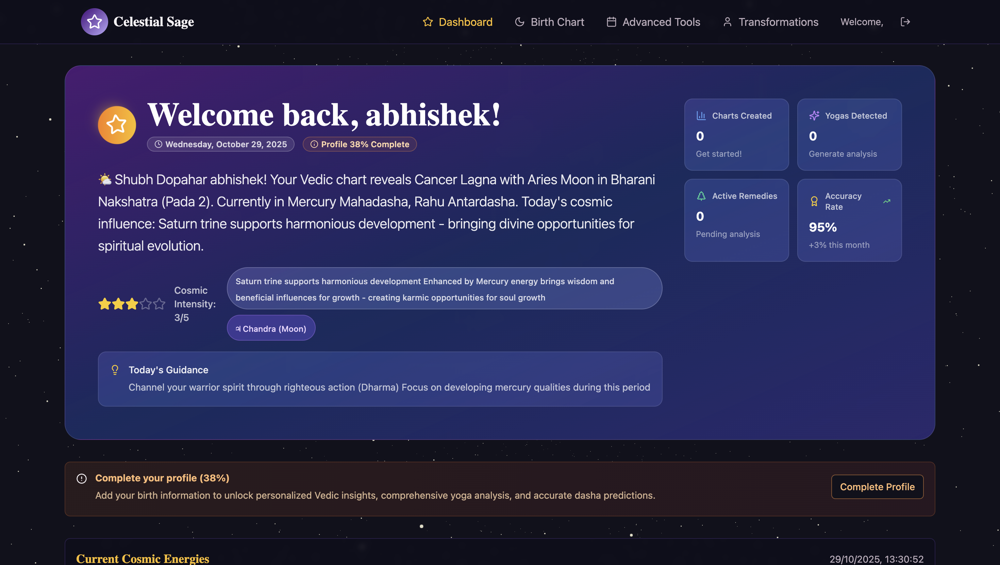
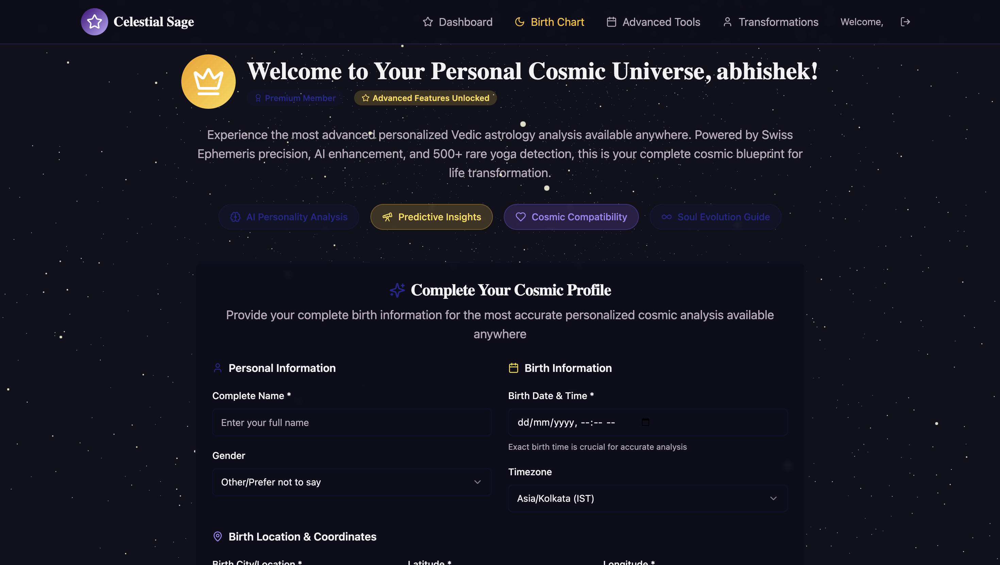
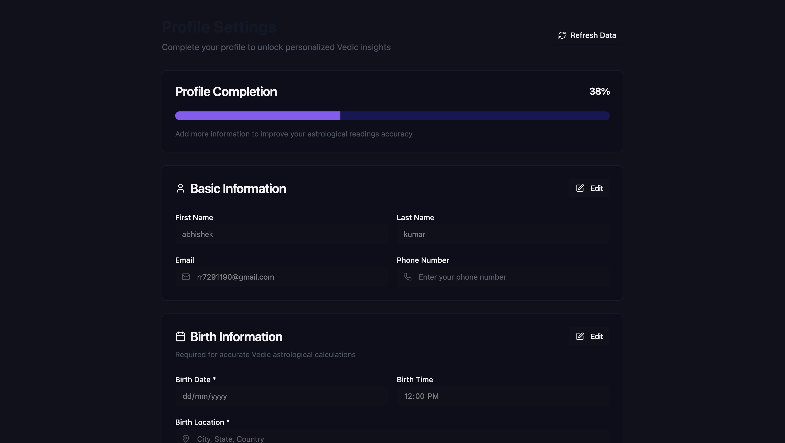
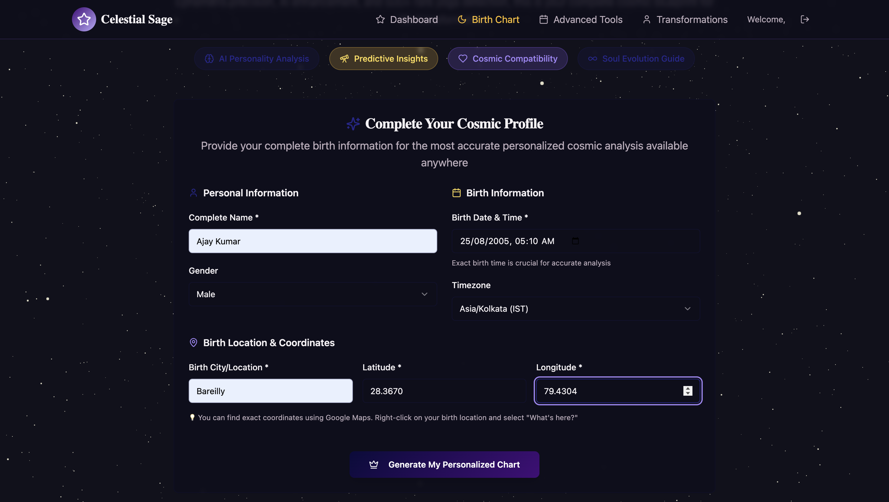
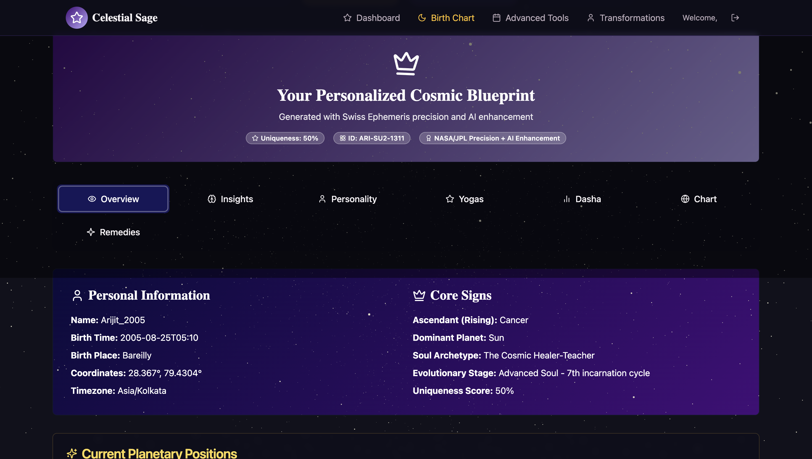
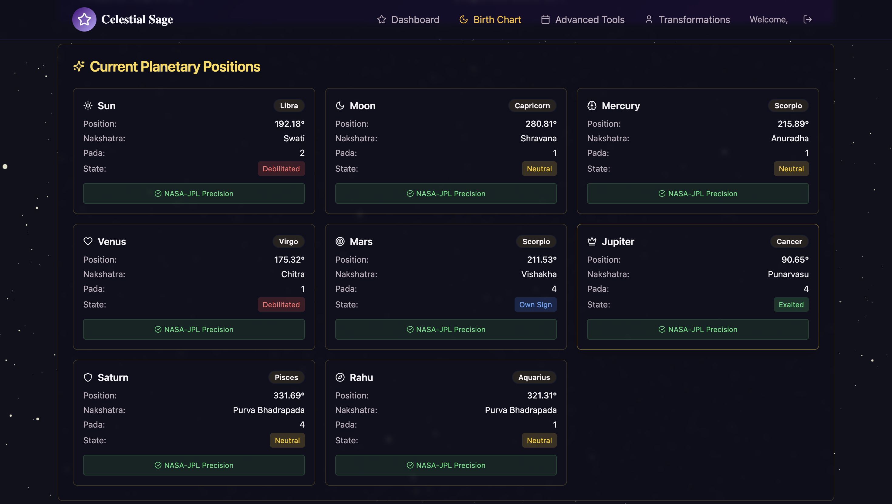
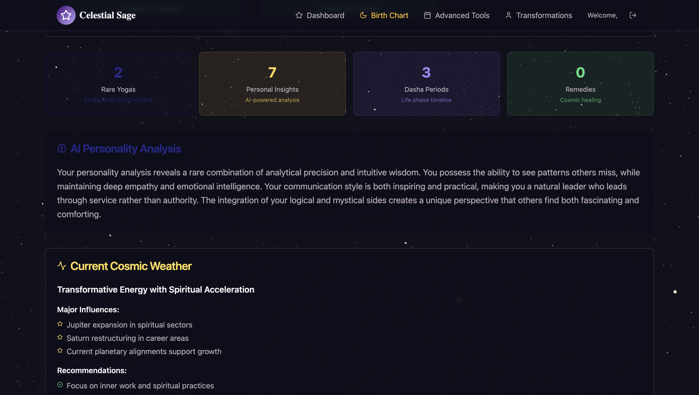
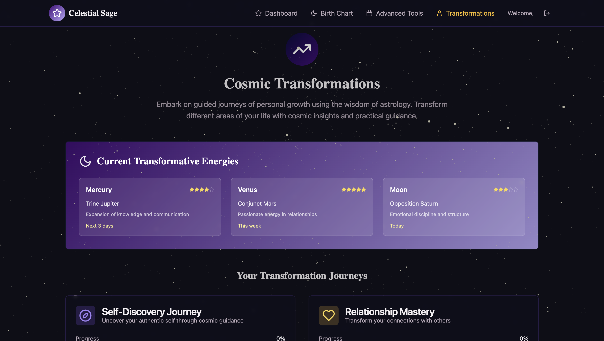

# 🌟 Cosmic Portal Horizon - Professional Astrology Platform

  

A comprehensive, modern astrology platform built with cutting-edge web technologies, offering personalized Vedic astrology consultations, birth chart analysis, and astrological guidance.

## 📋 Table of Contents

- [Overview](#overview)
- [Features](#features)
- [Technology Stack](#technology-stack)
- [Screenshots](#screenshots)
- [Installation](#installation)
- [Configuration](#configuration)
- [Usage](#usage)
- [API Documentation](#api-documentation)
- [Contributing](#contributing)
- [License](#license)

## 🔮 Overview

Cosmic portal Horizon is a professional astrology platform that combines ancient Vedic wisdom with modern technology. Built for astrologers and astrology enthusiasts, it provides accurate calculations, personalized insights, and a seamless user experience through an intuitive web interface.

The platform offers a unique alternative to existing astrology services by focusing on **personalized content**, **professional UI/UX design**, and **accurate astronomical calculations** using the Swiss Ephemeris library.

## ✨ Features

### 🎯 Core Astrology Features
- **Birth Chart Generation** - Accurate Vedic birth chart calculations with planetary positions
- **Dasha System** - Complete planetary period calculations and predictions
- **Live Planetary Positions** - Real-time astronomical data and planetary movements
- **Nakshatra Analysis** - Detailed star constellation insights and influences
- **House System** - Comprehensive house-based astrological analysis

### 🎨 Advanced Features
- **Compatibility Analysis** - Relationship compatibility through astrological matching
- **Career Guidance** - Professional guidance based on planetary influences
- **Remedies & Solutions** - Personalized astrological remedies and suggestions
- **Live Transits** - Current planetary influences and their effects
- **Transformations** - Life transformation insights through astrological analysis

### 💻 Technical Features
- **Responsive Design** - Optimized for all devices and screen sizes
- **Real-time Updates** - Dynamic content with live data synchronization
- **Secure Authentication** - JWT-based user authentication system
- **Professional Dashboard** - Comprehensive user management interface
- **Advanced Tools** - Sophisticated calculation and analysis tools

## 🛠️ Technology Stack

### Backend
- **Java 17** - Core programming language
- **Spring Boot 3.x** - Main backend framework
- **Spring Security** - Authentication and authorization
- **Spring Data JPA** - Database operations and ORM
- **Hibernate** - Object-relational mapping
- **MySQL** - Primary database
- **Swiss Ephemeris** - Astronomical calculations library
- **Maven** - Dependency management

### Frontend
- **React 18** - Frontend framework
- **TypeScript** - Type-safe JavaScript development
- **Vite** - Build tool and development server
- **Tailwind CSS** - Utility-first CSS framework
- **Shadcn UI** - Modern component library
- **React Router** - Client-side routing
- **Axios** - HTTP client for API calls

## 📸 Screenshots

### Landing Page & Homepage

  
  
<em>Modern, responsive landing page with elegant design</em>

### Authentication System

  
  
  
<em>Secure authentication with modern UI design</em>

### User Dashboard & Profile

  
  
<em>Comprehensive dashboard with personalized insights</em>

  
  
  
<em>User profile management and completion tracking</em>

### Birth Chart Analysis

  
  
  
<em>Detailed birth chart with comprehensive analysis</em>

  
  
  
<em>Extended chart analysis with multiple perspectives</em>

### Advanced Astrological Features

  
  
  
<em>Real-time planetary transits and life transformation insights</em>

  
  
<em>Sophisticated astrological calculation and analysis tools</em>

